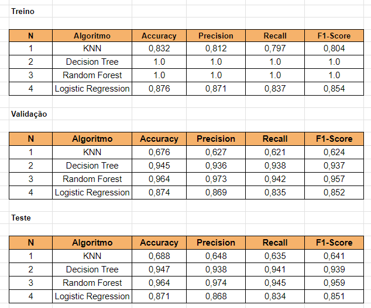
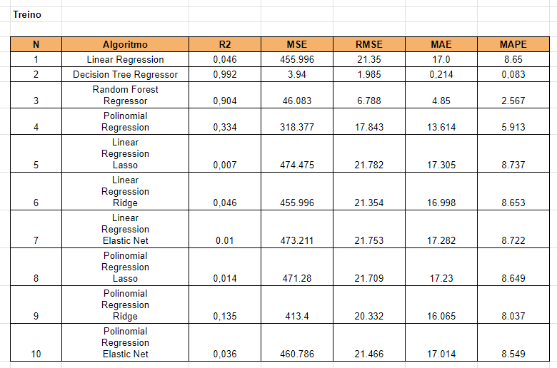
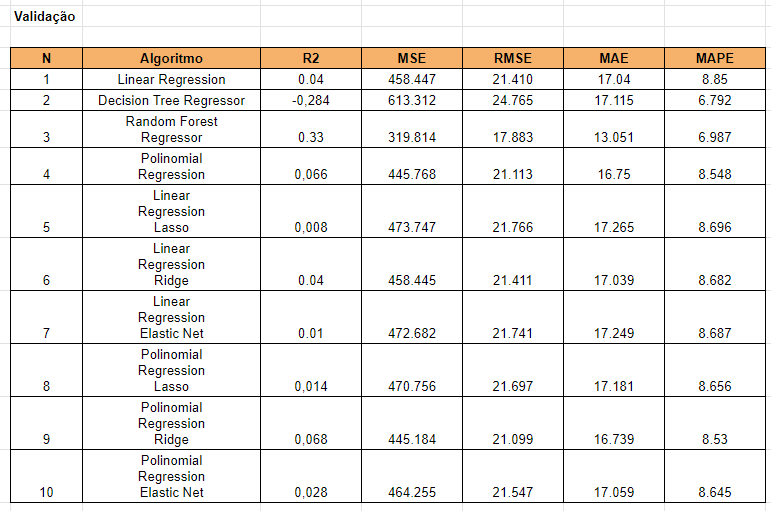
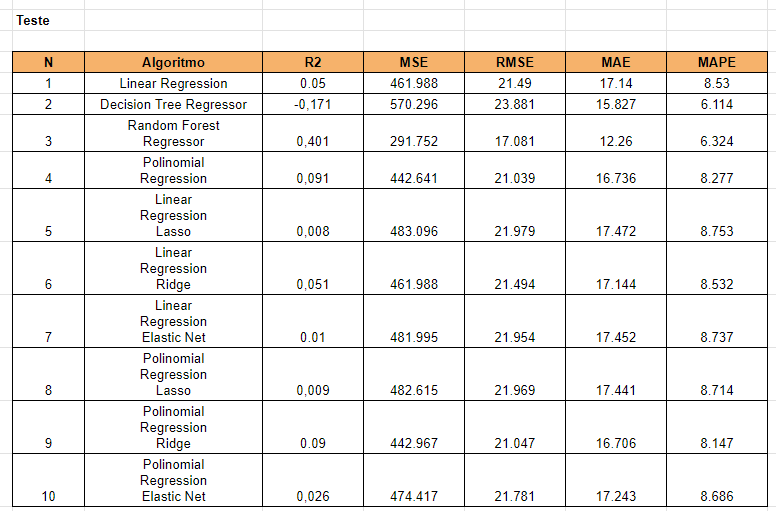

# Ensaio de Machine Learning

## Descrição
Este projeto tem como objetivo melhorar a performance dos modelos por meio do ajuste dos hiperparâmetros. Serão realizados ensaios com algoritmos de Classificação, Regressão e Clusterização para estudar como a performance se comporta à medida que os principais parâmetros de controle de overfitting e underfitting são modificados. Além disso, será observada a capacidade dos modelos de generalizar bem para os dados de teste.

# Planejamento da solução
A solução será 5 tabelas mostrando a performance dos algoritmos, avaliados usando múltiplas métricas, para 3 conjuntos de dados diferentes: Treinamento, Validação e Teste.

## Algoritmos ensaiados
### Classificação:
Algoritmos: KNN, Decision Tree, Random Forest e Logistic Regression

Métricas de performance: Accuracy, Precision, Recall e F1-Score

### Regressão:
Algoritmos: Linear Regression, Decision Tree Regressor, Random Forest
Regressor, Polinomial Regression, Linear Regression Lasso, Linear
Regression Ridge, Linear Regression Elastic Net, Polinomial Regression
Lasso, Polinomial Regression Ridge e Polinomial Regression Elastic Net

Métricas de performance: R2, MSE, RMSE, MAE e MAPE

### Agrupamento:
Algoritmos: K-Means e Affinity Propagation

Métricas de performance: Silhouette Score
## Ferramentas utilizadas
- **Bibliotecas:** Python 3.11 e Scikit-learn
- **Algoritmos de classificação:** KNN, Decision Tree, Random Forest e Logistic Regression
- **Métricas de performance:** Accuracy, Precision, Recall, F1-Score, R2, MSE, RMSE, MAE, MAPE e Silhouette Score
- **Algoritmos de regressão:** Linear Regression, Decision Tree Regressor, Random Forest Regressor, Polinomial Regression, Linear Regression Lasso, Linear Regression Ridge, Linear Regression Elastic Net, Polinomial Regression Lasso, Polinomial Regression Ridge e Polinomial Regression Elastic Net
- **Algoritmos de agrupamento:** K-Means e Affinity Propagation

# Desenvolvimento
## Estratégia da solução
Utilizei a linguagem Python para escrever os códigos, fazendo o treinamento de cada algoritmo, alternando seus principais parâmetros de ajuste para controlar o overfitting e observar a métrica final de performance. Os conjuntos de valores que proporcionarem a melhor performance foram escolhidos para o treinamento final de cada modelo.

## O passo a passo
- Passo 1: Divisão dos dados em treino, teste e validação.
- Passo 2: Treinamento dos algoritmos com os dados de treinamento, utilizando os parâmetros “default”.
- Passo 3: Medir a performance dos algoritmos treinados com o parâmetro
default, utilizando o conjunto de dados de treinamento.
- Passo 4: Medir a performance dos algoritmos treinados com o parâmetro
“default”, utilizando o conjunto de dados de validação.
- Passo 5: Alternar os valores dos principais parâmetros que controlam o
overfitting do algoritmo até encontrar o conjunto de parâmetros apresente
a melhor performance dos algoritmos.
- Passo 6: Unir os dados de treinamento e validação
- Passo 7: Retreinar o algoritmo com a união dos dados de treinamento e
validação, utilizando os melhores valores para os parâmetros de controle
do algoritmo.
- Passo 8: Medir a performance dos algoritmos treinados com os melhores
parâmetro, utilizando o conjunto de dados de teste.
- Passo 9: Avaliar os ensaios e anotar os 3 principais Insights que se
destacaram.

# Top-3 Insights

### Insight 1
Os algoritmos baseados em árvore apresentaram um desempenho melhor nos dados de classificação e e regressão.

## Insight 2
Nos dados de regressão, a Random Forest Regressor foi o modelo que melhor generalizou sobre os dados de teste e obteve o menor RMSE.

## Insight 3
Os dois algoritmos de agrupamento não apresentaram boas métricas de performance, o que mostra uma necessidade de uma seleção de atributos e um melhor pré-processamento dos dados.

# Resultados

## Ensaio de classificação:
---

## Ensaio de regressão:
### Sobre os dados de treinamento

### Sobre os dados de validação

### Sobre os dados de teste

## Ensaio de clusterização:
---

# Conclusão
Neste estudo de Machine Learning, adquiri experiência significativa e uma compreensão mais profunda sobre o funcionamento de diversos algoritmos. Os modelos baseados em árvores, por exemplo, são sensíveis à profundidade do crescimento e ao número de árvores na floresta e os algoritmos de regressão são sensíveis ao grau do polinômio.

Portanto, esse ensaio de Machine Learning foi essencial para aprofundar meu entendimento sobre o funcionamento desses algoritmos de classificação, regressão e clusterização, bem como sobre os principais parâmetros que controlam os estados de underfitting e overfitting.

# Próximos passos
Pretendo estudar outros algoritmos, aprofundar meus conhecimentos e aplicar isso resolvendo problemas reais de ciência de dados.
